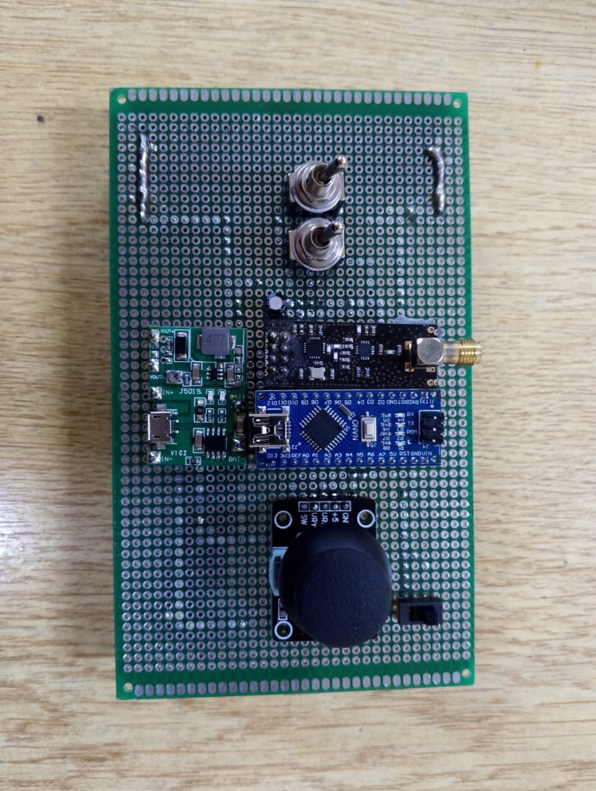
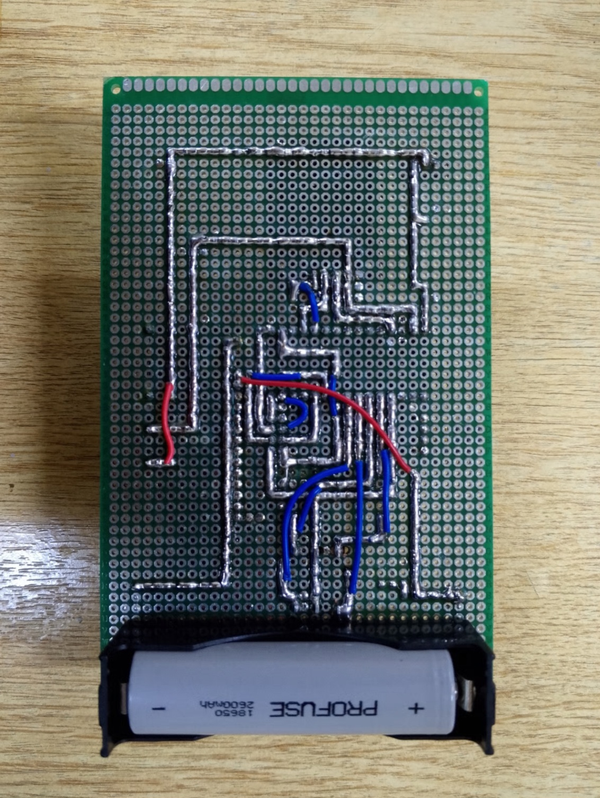
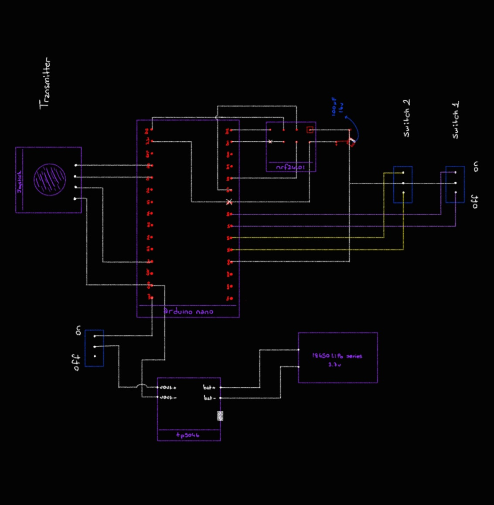
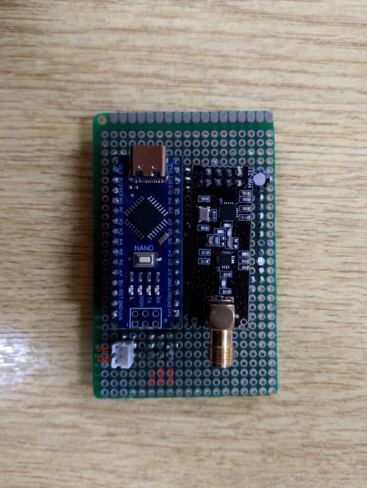
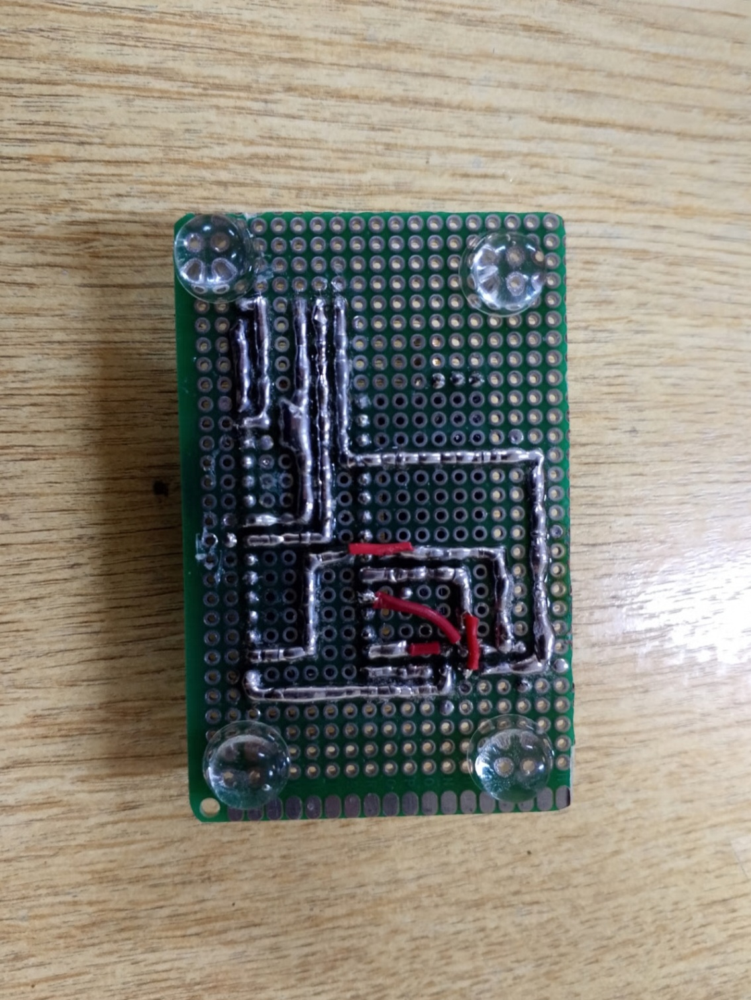
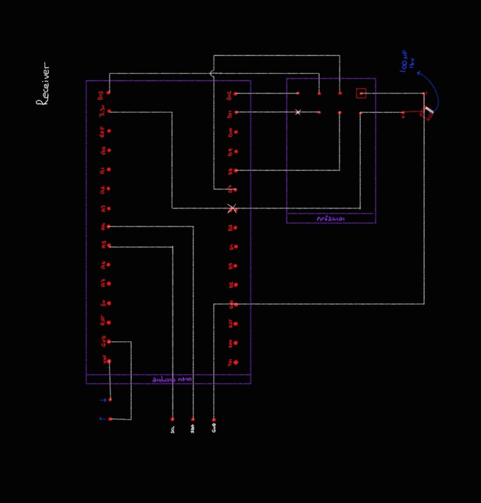

## 🎮 `nRF24 Joystick Transceiver Shield`

 

<h3> ⚡nRF24 Transmitter Shield </h3>

<h3> ⚡nRF24 Receiver Shield </h3>

 

- ✅ This project features a joystick-based transmitter shield and a receiver shield, both designed for the nRF24L01+ PA module, enabling seamless wireless communication for a wide range of remote control applications.

 

Used Technologies in The Project:

 

> 📱 Video [Link](https://youtube.com/shorts/6rhBQ6Ti7NQ?si=EJpQZLDAEJn7jkGk)

 

# License

This project is licensed under the MIT License. See the [LICENSE](LICENSE) file for details
